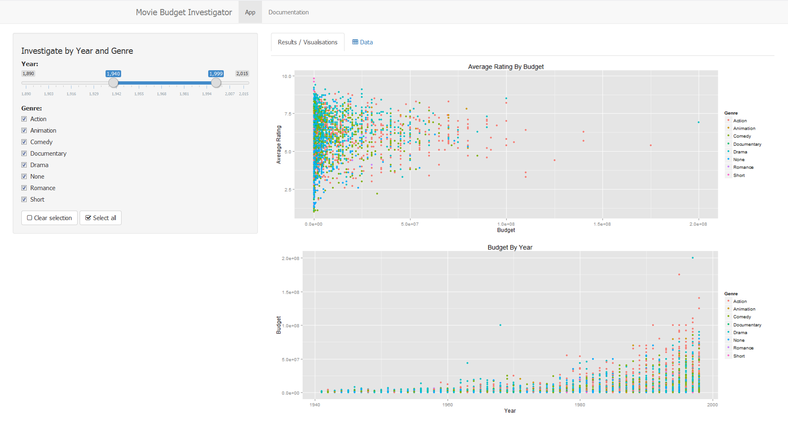

## Background

Huge sums of money are spent on creating movies every year, and this amount continues to increase year on year.

Using a sample with information on thousands of films, the highest budgeted films of 1990 and 2000, as relatively recent dates, show a substantial increase. This is shown in the calculations below. 

```{r, echo=FALSE} 
data_path <- "../data/movies.tab"
movies <- read.table(data_path, sep="\t", header=TRUE, quote="", comment="")
```

```{r}
movies1990 <- movies[movies$year=="1990" ,]
max(movies1990$budget, na.rm = TRUE)

movies2000 <- movies[movies$year=="2000" ,]
max(movies2000$budget, na.rm = TRUE)
```

--- 

## Motivation

<br>

But...

<br><br>

# Do the movies with larger budget tend to be the viewers favourites?

<br><br>

The Movie Budget Investigation application allows the user to investigate this question. 

--- 

## Features

<br><br>

This applications intuitive design allows the user to 

 - view the budget spent on a historical film catelog
 - investigate any potential link between budget and viewer rating
 - examine the film data, by searching or subsetting by year and genre

using a collection of thousands of films, dating back over 100 years.

---

## Application




The application can be found [here] (https://sionam.shinyapps.io/Developing_Data_Products_Project).
